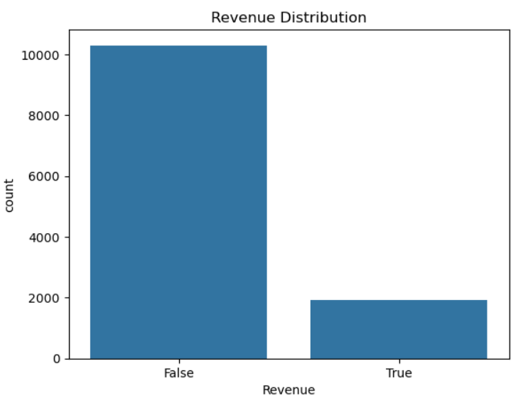
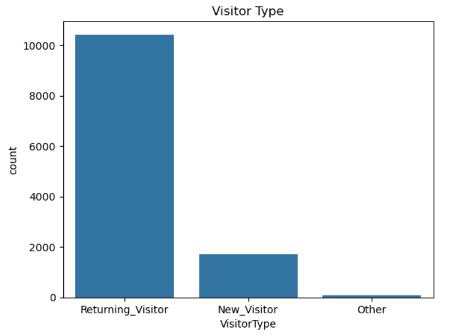
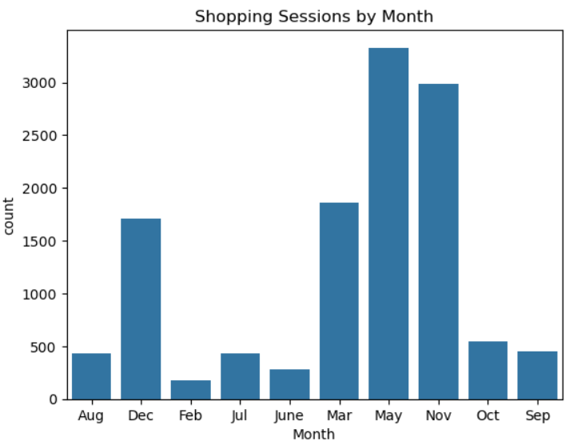
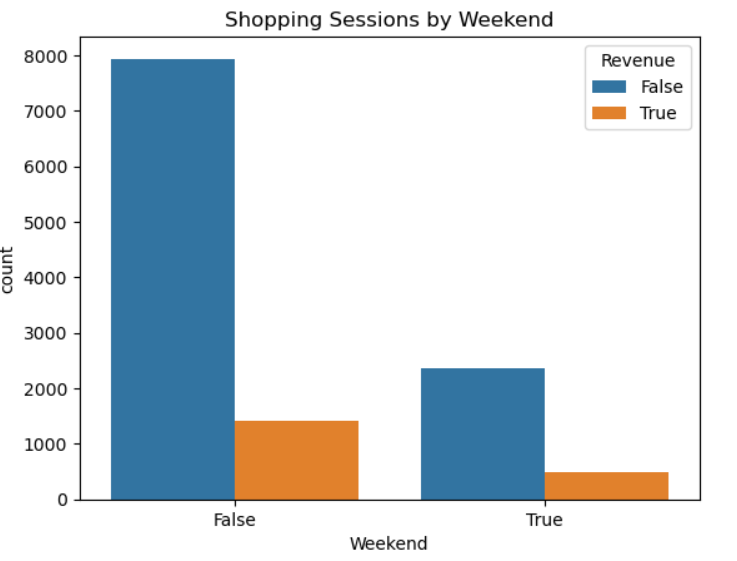
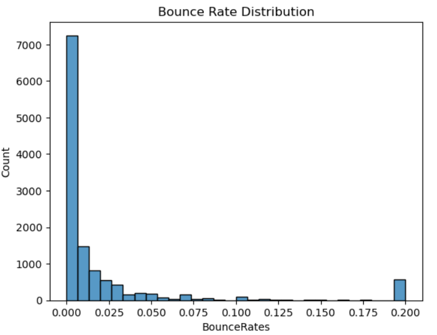
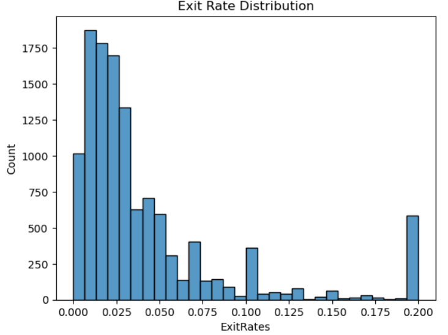
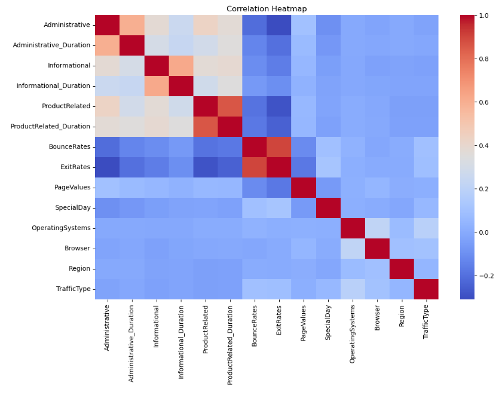

# 🛒 Online Shopping Purchase Intention Prediction using Apache Spark ML

## Project Overview

This project develops machine learning models to predict whether an online shopping session will result in a completed purchase using the **Online Shoppers Purchasing Intention Dataset**. The project applies Apache Spark for scalable data processing, Spark SQL for data analysis, and Spark MLlib for predictive modelling.

The dataset contains customer browsing behaviour, website interaction metrics, visitor characteristics, and purchasing outcomes. Through exploratory data analysis (EDA), feature engineering, and classification modelling, the project identifies the behavioural factors that most strongly influence customer purchasing decisions.

Three machine learning algorithms were developed and evaluated:

- Logistic Regression
- Decision Tree
- Random Forest

The project aims to provide valuable business insights that can support customer segmentation, personalized marketing, website optimization, and conversion rate improvement.

---

# Repository Structure

```
online-shopping-purchase-intention-prediction
│
├── 1. PySpark Data Preprocessing
│   ├── Load dataset
│   ├── Dataset exploration
│   ├── Data cleaning
│   ├── Missing value analysis
│   ├── Duplicate removal
│   ├── Feature encoding
│   └── Feature engineering
│
├── 2. Exploratory Data Analysis
│   ├── Revenue distribution
│   ├── Visitor type analysis
│   ├── Monthly shopping trend
│   ├── Weekend analysis
│   ├── Bounce rate analysis
│   ├── Exit rate analysis
│   ├── Product browsing behaviour
│   ├── Correlation heatmap
│   └── Business insights
│
├── 3. Spark SQL Analysis
│   ├── Revenue distribution
│   ├── Visitor segmentation
│   ├── Monthly purchase analysis
│   ├── Weekend purchasing behaviour
│   ├── Customer engagement analysis
│   └── Business interpretation
│
├── 4. Machine Learning
│   ├── Logistic Regression
│   ├── Decision Tree
│   ├── Random Forest
│   ├── Model evaluation
│   ├── Feature importance
│   ├── Model comparison
│   └── Best model selection
│
└── 5. Business Recommendations
    ├── Customer behaviour insights
    ├── Marketing recommendations
    ├── Website optimization
    ├── Conversion optimization
    └── Conclusion
```

---

# Dataset

**Dataset:** Online Shoppers Purchasing Intention Dataset

**Source:** [UCI Machine Learning Repository](https://archive.ics.uci.edu/dataset/468/online+shoppers+purchasing+intention+dataset)

### Dataset Summary

| Item | Description |
|------|-------------|
| Number of observations | 12,330 |
| Number of variables | 18 |
| Target variable | Revenue |
| Machine Learning Task | Binary Classification |

The dataset records customer browsing sessions collected from an e-commerce website, including information on website interaction, visitor characteristics, browsing duration, page values, and purchase outcomes.

---

# Technologies Used

- Apache Spark (PySpark)
- Spark SQL
- Spark MLlib
- Python
- Pandas
- Matplotlib
- Jupyter Notebook

---

# Project Workflow

```
Dataset
      │
      ▼
Data Cleaning
      │
      ▼
Exploratory Data Analysis
      │
      ▼
Spark SQL Analysis
      │
      ▼
Feature Engineering
      │
      ▼
Machine Learning Models
      │
      ▼
Model Evaluation
      │
      ▼
Business Insights
      │
      ▼
Recommendations
```

---

# Data Cleaning

The dataset was preprocessed to ensure high data quality before model development.

The following preprocessing steps were performed:

- Loaded the dataset into a Spark DataFrame.
- Examined the dataset dimensions and schema.
- Verified missing values across all variables.
- Removed duplicate shopping sessions.

For the data cleaning for Model Implementation:
- Converted the Boolean target variable (`Revenue`) into a binary numerical label.
- Converted the Boolean `Weekend` variable into numerical values.
- Encoded categorical variables (`Month` and `VisitorType`) using StringIndexer.
- Combined all predictor variables into a feature vector using VectorAssembler.
- Split the dataset into training and testing subsets (80:20).

These preprocessing procedures ensure that the dataset is suitable for Spark ML algorithms while maintaining data integrity.

---

# Data Visualizations

Exploratory Data Analysis (EDA) was performed to understand customer behaviour, identify important relationships among variables, and generate business insights before predictive modelling.

## Revenue Distribution



The revenue distribution demonstrates that approximately **84.5%** of shopping sessions did not result in a purchase, while only **15.5%** successfully completed a transaction. This indicates a highly imbalanced dataset, making evaluation metrics such as Precision, Recall, F1-score, and ROC-AUC more appropriate than relying solely on classification accuracy.

---

## Visitor Type Distribution



Returning visitors represent the majority of website traffic, accounting for more than 85% of all shopping sessions. This suggests strong customer retention and brand loyalty. However, the relatively small proportion of new visitors indicates opportunities to strengthen customer acquisition strategies through digital marketing and search engine optimization.

---

## Monthly Shopping Behaviour



Shopping activity varies considerably throughout the year. November exhibits the highest purchase conversion rate, reflecting the influence of promotional events such as Black Friday and Cyber Monday. Although May records the highest traffic volume, its lower conversion rate suggests that many visitors browse products without completing purchases, highlighting opportunities for remarketing campaigns.

---

## Weekend Purchasing Behaviour



Weekend visitors demonstrate a higher purchase conversion rate than weekday visitors despite generating fewer sessions overall. This indicates that customers have more available time to complete purchases during weekends, making weekend promotions and flash sales particularly effective.

---

## Bounce Rate and Exit Rate





Purchasing customers exhibit significantly lower Bounce Rates and Exit Rates than non-purchasing visitors. Higher bounce and exit rates suggest website usability issues or customer dissatisfaction during browsing. Improving page loading speed, navigation, and checkout processes may reduce customer abandonment and improve conversion rates.

---

## Correlation Heatmap



The correlation heatmap reveals that most numerical variables exhibit weak to moderate relationships, indicating limited multicollinearity within the dataset. Strong positive correlations are observed between **ProductRelated** and **ProductRelated_Duration**, suggesting that customers who browse more product pages naturally spend more time exploring them. Similarly, **BounceRates** and **ExitRates** are highly correlated, implying that users who leave pages quickly are also more likely to exit the website before completing purchases. Overall, customer browsing behaviour contributes far more to purchase prediction than calendar-based factors such as **SpecialDay**.

---

# Spark SQL Analysis

Spark SQL was used to perform descriptive business analysis directly on the processed dataset.

The SQL analyses include:

- Revenue distribution
- Visitor segmentation
- Monthly purchase trends
- Weekend purchasing behaviour
- Bounce and Exit Rate comparison
- Product browsing behaviour

Using Spark SQL demonstrates the ability to perform efficient analytical queries on distributed datasets while providing business-oriented summaries that support decision-making.

---

# Machine Learning Models

Three supervised learning algorithms were implemented using Spark MLlib.

## Logistic Regression

Logistic Regression serves as the baseline classification model by estimating the probability of customer purchases using a linear decision boundary.

## Decision Tree

Decision Tree learns hierarchical decision rules from customer browsing behaviour, allowing nonlinear relationships between predictors and purchasing outcomes to be captured.

## Random Forest

Random Forest combines multiple decision trees to improve prediction accuracy and reduce overfitting. The ensemble approach generally produces more stable predictions than individual decision trees.

---

# Model Evaluation

The models were evaluated using multiple classification metrics because the dataset is highly imbalanced.

Evaluation metrics include:

- Accuracy
- Precision
- Recall
- F1-score
- ROC-AUC
- Confusion Matrix

## Model Comparison

| Model | Accuracy | Precision | Recall | F1-Score | ROC-AUC |
|--------|----------|-----------|--------|----------|----------|
| Logistic Regression | 88.43% | 87.42% | 88.43% | 86.68% | 90.35% |
| Decision Tree | 89.68% | 89.16% | 89.68% | 89.34% | 77.48% |
| Random Forest | **91.47%** | **91.02%** | **91.47%** | **91.12%** | **94.59%** |

The Random Forest model consistently achieved the highest predictive performance across all evaluation metrics. Its superior ROC-AUC demonstrates an excellent ability to distinguish purchasing customers from non-purchasing customers, while the high Precision and Recall indicate reliable classification performance despite the class imbalance.

---

## Random Forest Feature Importance


Feature importance analysis reveals that customer browsing behaviour contributes substantially more to purchase prediction than demographic variables.

The important predictors include:

|**Top Features**|**Lowest Features**|
|---|---|
|1. PageValues|1. SpecialDay|
|2. ExitRates|2. Region|
|3. TrafficType|3. Weekend|
|4. ProductRelated|4. Informational_Duration|
|5. ProductRelated_Duration|5. Month|

Feature importance analysis demonstrates that customer browsing behaviour contributes far more to purchase prediction than demographic characteristics. Among all variables, **PageValues** emerged as the most influential predictor, accounting for more than half of the model's predictive capability. This indicates that visitors who interact with high-value webpages are considerably more likely to complete purchases.

Similarly, ProductRelated pages, browsing duration, and ExitRates were identified as important behavioural indicators of purchasing intention. In contrast, variables such as Region, SpecialDay, and Weekend contributed relatively little to the predictive model. These findings suggest that real-time customer behaviour provides substantially more predictive information than static customer characteristics.

---

# Insights and Explanations

The project generated several valuable business insights:

- The dataset exhibits a high purchase conversion rate of approximately 15.6%, indicating that website visitors generally possess strong purchasing intent.
- Returning visitors account for the majority of customer traffic, demonstrating effective customer retention.
- November achieves the highest purchase conversion efficiency due to seasonal promotional campaigns.
- Weekend visitors exhibit higher purchasing probabilities than weekday visitors.
- Customers who browse more product pages and spend longer durations exploring products are significantly more likely to complete purchases.
- Lower Bounce Rates and Exit Rates are strongly associated with successful purchasing behaviour.
- Customer browsing behaviour contributes far more to purchase prediction than demographic information.
- Random Forest provides the highest predictive performance among all evaluated machine learning algorithms.

---

# Recommendations

Based on the exploratory data analysis and machine learning results, several recommendations are proposed to improve customer engagement, increase conversion rates, and support data-driven business decision-making.

---

## 1. Improve Website Navigation and User Experience

The analysis showed that non-purchasing customers exhibited significantly higher Bounce Rates and Exit Rates than purchasing customers. This indicates that many users leave the website before reaching the checkout process, possibly due to confusing navigation, slow page loading speeds, complicated checkout procedures, or insufficient product information.

To address these issues, the business should optimize website usability by simplifying navigation, improving page loading performance, streamlining the checkout process, and providing clear product descriptions, pricing, shipping information, and return policies. Reducing customer frustration throughout the browsing journey can encourage users to remain on the website longer and increase the likelihood of completing a purchase.

---

## 2. Implement Personalized Product Recommendation Systems

The exploratory analysis revealed that purchasing customers viewed significantly more product pages and spent substantially longer browsing than non-purchasing customers. Furthermore, Random Forest identified ProductRelated, ProductRelated_Duration, and PageValues as some of the most influential predictors of purchase intention.

These findings suggest that encouraging customers to explore additional products can positively influence purchasing behaviour. Therefore, the business should implement personalized recommendation systems that suggest similar products, complementary items, or frequently purchased combinations based on customers' browsing history. Such recommendation engines can increase customer engagement, average session duration, and overall sales revenue.

---

## 3. Develop Real-Time Purchase Prediction for Personalized Marketing

The Random Forest model achieved the highest predictive performance, with excellent Accuracy, F1-score, and ROC-AUC values. This demonstrates that customer purchase intention can be predicted reliably using real-time browsing behaviour.

The trained model can be integrated into a Customer Relationship Management (CRM) platform or Customer Data Platform (CDP) to identify high-potential customers while they are actively browsing the website. Once a customer is predicted to have a high probability of purchasing, personalized marketing actions such as discount vouchers, product recommendations, limited-time promotions, or free shipping offers can be triggered automatically. This enables businesses to provide targeted marketing rather than offering promotions indiscriminately to all visitors.

---

## 4. Strengthen Customer Acquisition Strategies

The visitor analysis indicated that Returning Visitors accounted for more than 85% of website traffic, demonstrating strong customer loyalty and effective customer retention. However, the relatively small number of New Visitors suggests that customer acquisition efforts could be improved.

To expand the customer base, the business should invest in digital marketing strategies such as search engine optimization, social media advertising, influencer marketing, and targeted online advertising campaigns. Increasing the proportion of first-time visitors while maintaining existing customer loyalty can contribute to sustainable business growth.

---

## 5. Optimize Marketing Campaigns Based on Seasonal Trends

The monthly analysis demonstrated clear seasonal purchasing behaviour, with November achieving the highest purchase conversion rate due to major promotional events such as Black Friday and Cyber Monday. In contrast, some months generated high website traffic but relatively low conversion rates.

Businesses should allocate marketing budgets strategically according to seasonal demand. During high-conversion periods, promotional campaigns should focus on maximizing sales through limited-time offers and inventory planning. During lower-conversion months, remarketing campaigns can be used to re-engage visitors who browsed products but did not complete purchases, thereby improving conversion efficiency.

---

## 6. Leverage Weekend Shopping Behaviour

The analysis showed that weekend visitors achieved a higher purchase conversion rate than weekday visitors despite representing a smaller proportion of total website traffic. This suggests that customers have more available time to compare products and complete purchases during weekends.

Businesses should capitalize on this behaviour by scheduling weekend-exclusive promotions, flash sales, free shipping campaigns, or personalized notifications. These targeted marketing activities can encourage customers to complete purchases during periods when purchasing intention is naturally higher.

---

## 7. Utilize Feature Importance for Business Decision-Making

Feature importance analysis identified PageValues, ProductRelated, ProductRelated_Duration, ExitRates, and TrafficType as the most influential predictors of customer purchasing behaviour. These variables reflect customers' real-time interactions with the website rather than static demographic characteristics.

Instead of relying primarily on demographic segmentation, businesses should focus on behavioural analytics to personalize customer experiences. Monitoring customers' browsing activities, page engagement, and exit behaviour allows businesses to intervene proactively by recommending products, providing live assistance, or offering promotional incentives before customers leave the website.

---

## 8. Continuously Monitor and Retrain the Prediction Model

Customer preferences, shopping behaviour, and marketing campaigns evolve over time. Consequently, predictive models may gradually lose accuracy if they are not updated regularly.

Businesses should continuously collect new customer interaction data and periodically retrain the machine learning model to maintain prediction accuracy. Regular model evaluation and performance monitoring ensure that the prediction system remains effective under changing customer behaviour and market conditions.

---

## Overall Recommendation

Based on the comparative evaluation, the Random Forest model is recommended for practical deployment because it achieved the highest predictive performance across all evaluation metrics while providing interpretable feature importance rankings. Integrating this model into business operations can support personalized marketing, customer segmentation, website optimization, and real-time purchase prediction. Combined with improvements in website usability, targeted promotional strategies, and customer acquisition initiatives, these recommendations can help increase customer engagement, improve conversion rates, and enhance long-term business performance.

---

# Conclusion

This project demonstrates how Apache Spark can be applied to perform scalable data processing, exploratory analysis, and machine learning for online shopping purchase prediction.

Among the evaluated models, Random Forest achieved the highest predictive performance and identified customer browsing behaviour as the primary determinant of purchasing intention.

The findings provide valuable business intelligence for improving customer engagement, optimizing website performance, supporting personalized marketing strategies, and increasing overall online sales.

---

# Future Improvements

Potential future enhancements include:

- Hyperparameter tuning using Cross Validation
- Class imbalance handling using class weighting or SMOTE
- Additional machine learning algorithms (e.g., XGBoost, Gradient Boosting)
- Real-time prediction using Spark Structured Streaming
- Customer segmentation using clustering techniques

---

# Author

**Than Tian En**

Master of Data Science

Universiti Kebangsaan Malaysia (UKM)

Course: **STQD6324 Data Management**
